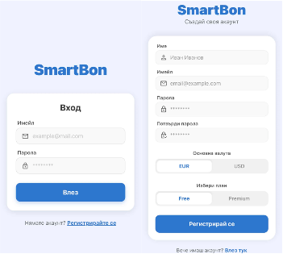
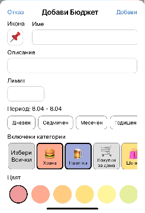
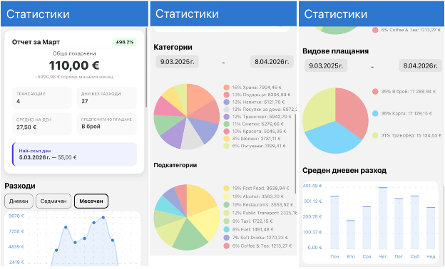
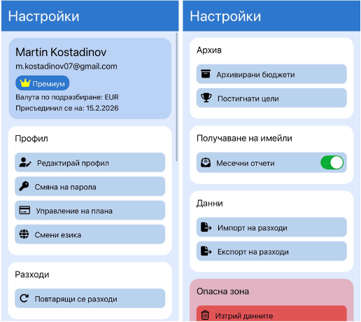
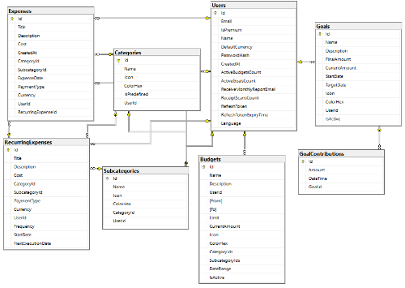
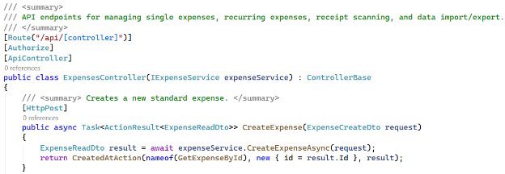
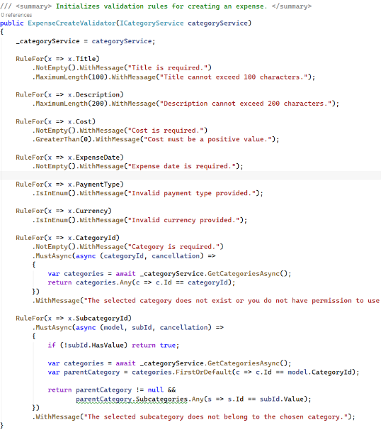
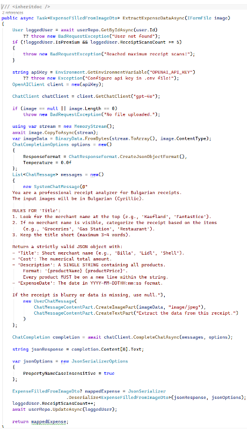
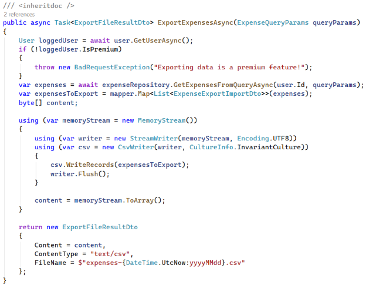

# SmartBon

> **Intelligent Personal Finance Management Mobile Application with AI Receipt Scanning**

SmartBon is a next-generation mobile application designed to automate and simplify personal finance management. Built to solve the tedious problem of manual expense tracking, SmartBon leverages Artificial Intelligence (OpenAI Vision) to instantly extract crucial data from receipt images. 

Developed as a diploma project by Martin Atanasov Kostadinov.

---

## Table of Contents
- [About the Project](#about-the-project)
- [Key Features](#key-features)
  - [Basic Plan (Free)](#basic-plan-free)
  - [Premium Plan](#premium-plan)
- [Screenshots & UI](#screenshots--ui)
- [Technology Stack](#technology-stack)
- [Architecture](#architecture)
- [Getting Started](#getting-started)
- [License & Copyright](#license--copyright)

---

## About the Project
Managing personal finances is crucial for financial stability, yet many people give up on expense tracking because manual entry is slow, tedious, and prone to errors. 

**SmartBon** acts as your personal automated accountant. By simply taking a picture of a receipt, the integrated AI pipeline extracts the date, total amount, and individual items. The ecosystem offers robust tools for budgeting, savings goals, recurring subscriptions, and detailed visual statistics.

---

## Key Features

### Basic Plan (Free)
- **AI Receipt Scanning:** Up to 5 AI scans per month to automatically read and categorize your paper receipts.
- **Expense Tracking:** Full CRUD operations for manual transaction entry.
- **Budget Management:** Set general monthly budget limits and track your spending.
- **Savings Goals:** Track up to 2 active savings goals (e.g., "New Laptop", "Vacation") and add contributions.
- **Categorization:** Use predefined system categories or create basic custom ones.
- **Statistics & Filtering:** View your spending habits with simple charts and filter transactions by date, amount, category, or payment method.

### Premium Plan
- **Unlimited AI Scanning:** Fully digitize all your receipts without monthly caps.
- **Recurring Expenses:** Automate your subscriptions (Netflix, rent) with customizable intervals (weekly, monthly, yearly) using background workers.
- **Advanced Customization:** Create custom subcategories and set specific budgets per category.
- **Unlimited Goals:** Track as many parallel savings goals as you need.
- **Advanced Analytics:** Detailed visual reports including pie charts for categories and payment types, and line charts for spending trends.
- **Data Portability:** Export your financial history to a CSV file.
- **Automated Email Reports:** Receive detailed financial summaries via email at the end of every month.

---

## Screenshots & UI

### App Interface

*Authentication and User Registration*


*Adding a new expense*


*Budget creation screen*


*Expense list, advanced filtering, and sorting*


*Detailed graphical statistics and analytics*


*Settings, data management, and Danger Zone*

---

## Technology Stack

### Mobile Client (Frontend)
- **Framework:** React Native with Expo
- **Language:** TypeScript
- **Routing:** Expo Router (File-based routing)
- **State Management & API:** Zustand
- **UI & Graphics:** `react-native-chart-kit`, `react-native-svg`
- **Localization:** `i18next`, `react-i18next`
- **Security:** `expo-secure-store` (JWT Storage)

### Server (Backend API)
- **Framework:** ASP.NET Core (.NET 9)
- **Language:** C# 12
- **Database ORM:** Entity Framework Core (Code-First)
- **AI Integration:** OpenAI SDK (`gpt-4o` Vision model)
- **Validation & Mapping:** FluentValidation, AutoMapper
- **Utilities:** CsvHelper, FluentEmail, Serilog

### Database
- Microsoft SQL Server 2022

---

## Architecture

SmartBon follows a strict Client-Server model.

**Backend N-Tier Architecture:**
1. **API Layer:** Thin controllers handling HTTP requests and global Exception Middleware.
2. **Services Layer:** Contains core business logic, validation rules, AutoMapper profiles, and Background Hosted Services (for recurring expenses and emails).
3. **Data Layer:** Entity Framework DbContext, Models, Migrations, and Repositories.
4. **Shared Layer:** DTOs (Data Transfer Objects), Enums, and Custom Exceptions.

**Database Schema:**


### Code Snippets Highlights
-  *(Thin Controllers example)*
-  *(Fluent Validation rules)*
-  *(OpenAI Prompt Engineering & Integration)*
-  *(CSV Generation with CsvHelper)*

---

## Getting Started

### Prerequisites
- Node.js & npm (for the Expo frontend)
- .NET 9 SDK (for the ASP.NET Core backend)
- SQL Server 2022
- An OpenAI API Key

### Running the Backend (API)
1. Navigate to the API directory.
2. Update the `appsettings.json` with your SQL Server connection string and SMTP settings.
3. Set your OpenAI API key in your environment variables (`OPENAI_API_KEY`).
4. Apply database migrations:
   ```bash
   dotnet ef database update
   ```
5. Run the server:
   ```bash
   dotnet run
   ```

### Running the Mobile App
1. Navigate to the mobile app directory.
2. Install dependencies:
   ```bash
   npm install
   ```
3. Update the API base URL in your configuration to point to your local backend.
4. Start the Expo development server:
   ```bash
   npx expo start
   ```

---

## 📄 License & Copyright
This software was developed as an educational diploma project by **Martin Atanasov Kostadinov**. All rights to the architecture, source code, and UI/UX design belong to the author.

Built using open-source tools including React Native (MIT), ASP.NET Core (MIT), and OpenAI SDK (MIT).
